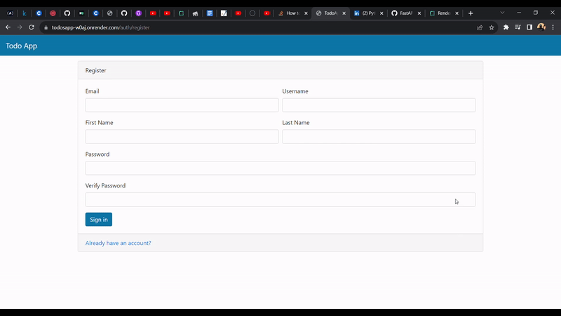

# Fast API : To Do App


This project is developed as part of learning from Fast API udemy course from Eric Roby.
I have deployed this app for free in render.com (Fast API) and elephantsql.com (PostgreSQL DB)
to use this app in action go to :  [ToDosApp](https://todosapp-w0aj.onrender.com) Let me know your todos ;)

- This API has User login / Registration page / logout , where user's password are stored as Hashes in Database
- JWT authentication is used , token stored in cookies.
- CRUD operations for To Do List
- PostgreSQL for Database
- Time zone information is fetched from javascript and sent as cookie to backend server where token , refresh token are set based on that so works for users across different Timezones
- command for starting the app : gunicorn -w 2 -k uvicorn.workers.UvicornWorker main:app
- to deploy app in docker here are the following commands
  - docker login {server} -u {username} -p {password}
  - docker build -t {server}/{appname}:build-tag-{}
  - docker push {server}/{appname}:build-tag-{}

## Tech Stack

**Tools :** PyCharm , pgAdmin , MySQL , Postman

**Front End:** HTML , CSS , Bootstrap

**Back End:** Uvicorn , Fast API , Pydantic , PostgreSQL , SQL Alchemy , JWT authentication


## Deployment

To deploy this project run

```bash
  uvicorn main:app --reload --port 5000
```


## API Reference

#### Get Registration page

```http
  GET /auth/register
```

#### Submit Registration form

```http
  POST /auth/register
```


#### logout from application

```http
  GET /auth/logout
```

#### get refresh token to extend session 

```http
  POST /auth/refresh-token
```

#### go to login page

```http
  POST /auth
```
#### to dos main page showing all todos list

```http
  GET /todos
```
#### get add todos html page

```http
  GET todos/add-todo
```

#### submit add todos form

```http
  POST todos/add-todo
```

#### get edit todo item html page

```http
  GET todos/edit-todo/{todo_id}
```

#### submit edit todo form

```http
  POST todos/edit-todo/{todo_id}
```

#### Delete todo item from List

```http
  GET todos/delete/{todo_id}
```

#### mark a todos item as complete from the list

```http
  GET todos/complete/{todo_id}
```

#### get Change User password html page

```http
  GET users/edit-password
```

#### Submit Change User password form to change password

```http
  POST users/edit-password
```


## Demo

<p align="center">
  
</p>

## Acknowledgements

 - [FastAPI - The Complete Course 2023 (Beginner + Advanced)](https://www.udemy.com/course/fastapi-the-complete-course/#instructor-1)


## Authors

- [@praveenRI007](https://www.github.com/praveenRI007)

